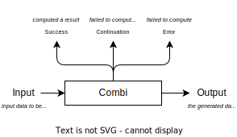

## Combi

### What is this?

A small combinator library, allowing functions that succeed, fail or can be _continued_/ignored to be composed.

Before you ask: _"Isn't this just functions with extra steps"_, no! Its monads with extra steps.

The lbrary contains an implementation of a parser combinator library atop combi, for building tokenstream parsers reporting compiler diagnostics for procedural macros.

### Things to do Better!

- [ ] The [Combi::Repr] trait is not ideal, supporting some kind of visitpor would be more ideal
- [ ] Coloured text from the tokens library is not working
- [ ] Span joins cause a panic on stable.
- [ ] Improved `rustc_unimplemented` messages for tokens
- [ ] The text parser
- [ ] Benchmarks to track performance regressions
- [ ] investigation of how much manual inlining is required
