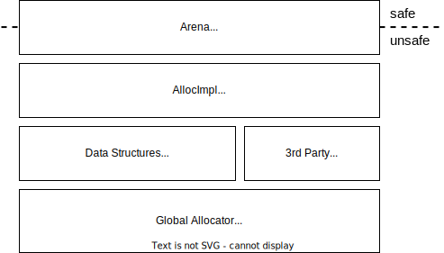

# Better Arenas
## What is this?
A library of fast arena types, with different ownership models.
 - Arena implementation abstracted as an allocator.
 - Different ownership semantics used to improve performance.

Traditional arenas such as [typed generational area](https://gitlab.com/tekne/typed-generational-arena) do not have optimally low overhead compared with raw pointer use as:
 - Large index types (while smaller indices are supported, a generation count must also be included to solve the [ABA problem](https://en.wikipedia.org/wiki/ABA_problem))
 - Bounds checks (on both access to the backing data structure, and checks on the given slot containing a value)
 - Unintentional leaks when indicies are dropped & the allocation is unreachable, but the arena does not drop the value.

Here we attempt to solve the [ABA problem](https://en.wikipedia.org/wiki/ABA_problem), and improve upon the above mentioned issues, using panicking drops & unique tags for indices.

## Structure

The arena layer can implement custom semantics for indicies (e.g. reference counting), unique types for instances of the arena, to then use it optimisation (e.g. removing bounds checks).

### Solving the ABA Problem without generation counts
To solve this we need the following invariant:
 - If I have an key, the allocation cannot be deleted.

We gain this for an `Own` arena by making indices non-copyable, uniquely typed per instance of the arena, and consumed on deletion.
 - Hence If [`prelude::DeleteArena::delete`] is called with a key, it must exist, and will be unreachable once passed in as an argument.

Likewise with reference counting, we can get the invariant that the number of keys is the same as the allocation's reference count, by requiring a mutable reference to the arena to copy a key.

### Unique Types
We can use pass an onbject containing an `FnOnce` closure to the arena, and base the key type from this to give all keys of an arena this type.

However this `FnOnce` closure can be re-created with the same anonymous type.
 - Hence we enforce it is only used by one arena at a time, by including a captured static `AtomicBool`, which is checked on arena construction, and unset on arena destruction.

### Key Types
Keys can be implemented as small as `u8`, allowing reference counted or owned arenas, with very small keys.

### Owned Keys
Keys are not copyable.
