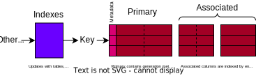

# Pulpit
A library for generating tablular data structures, used to support .

Includes both the underlying data structures, the code generation and the macro interface.

## Table Structure


Pulpit allows for both entirely nary (one `primary`), entirely decomposed (each column in a different associated), and combinations between.
- Indexes supported are currently limited to just the `Unique` index, kept separately from the data storage.
- Depending on the requirement for transactions, and for the deletion operation, the table structure can be chosen to improve performance.
- Tables differentiate between a mutable and immutable section for each row. This allows optimisatons such as returning references into the table for immutable data.
- Tables are accessed through a safe interface (either macro generated, or directly through a `primary`)

## Table Windows
In order to bind the lifetimes of immutable borrows from inside the table data structure to the lifetime for which the table is not moved requires building a `window` into the table to interact.
FUll explanation is included in [`crate::value`]. 
```rust
use pulpit::column::*;
let mut table = PrimaryRetain::<i32, i32, 1024>::new(1024);
{
    let mut window = table.window();
    // window (and returned references) are valid for this scope    
}  
let mut window_2 = table.window();
// ...
```

## Macro Interface
Macros to generate table implementations (using associateds, with indexes, tracked with a transaction log) are included.

*TODO: The below example causes a rustc segfault as of rustc 1.80.0-nightly (032af18af 2024-06-02)*
```rust,ignore
#[allow(dead_code)]
#[derive(Clone)]
enum RGB {
    Red,
    Green,
    Blue,
}

pulpit::macros::simple! {
    fields {
        name: String,
        id: usize @ unique(unique_reference_number),
        age: u8,
        fav_rgb_colour: crate::RGB,
    },
    updates {
        update_age: [age],
    },
    gets {
        get_all: [name, id, age, fav_rgb_colour],
    },
    predicates {
        adults_only: *age > 18,
        age_cap: *age < 100,
    },
    limit {
        cool_limit: 2000
    },
    transactions: on,
    deletions: on,
    name: bowling_club
}

fn main() {
    // We generate a basic table, and open a window into it
    let mut x = bowling_club::Table::new(1024);
    let mut w = x.window();

    // We can then insert some data, which is checked against the predicates and unique constraints
    let bill_key = w
        .insert(bowling_club::insert::Insert {
            id: 0,
            fav_rgb_colour: RGB::Blue,
            name: String::from("Bill Bob"),
            age: 50,
        })
        .unwrap();

    // We can also update the data using the update method we described in the macro
    w.update_age(
        bowling_club::updates::update_age::Update { age: 51 },
        bill_key,
    )
    .unwrap();

    // The count is correct
    assert_eq!(w.count(), 1);

    // By committing the data, it can no longer be easily rolled back
    w.commit();

    // We try with another insert, however the age constraint is breached, so it fails
    let fred_insert = w.insert(bowling_club::insert::Insert {
        id: 1,
        fav_rgb_colour: RGB::Red,
        name: String::from("Fred Dey"),
        age: 101,
    });
    assert!(matches!(
        fred_insert,
        Err(bowling_club::insert::Error::age_cap)
    ));

    // With an updated age we can now insert
    let fred_key = w
        .insert(bowling_club::insert::Insert {
            id: 1,
            fav_rgb_colour: RGB::Red,
            name: String::from("Fred Dey"),
            age: 30,
        })
        .unwrap();

    // We can grab data from the table, as a retaining arena is used for the table, and we do not
    // update the names, we can pull references to the names that live as long as `w` (the window)
    let names = vec![w.get(fred_key).unwrap().name, w.get(bill_key).unwrap().name];

    // After deciding fred is not so cool, we roll back and un-insert him
    assert_eq!(w.count(), 2);
    w.abort();
    assert_eq!(w.count(), 1);

    // While the mutable data for the table is removed, the names are still valid & safely accessible
    // by these references until the window is destroyed.
    println!("{} and {}", names[0], names[1]);

    // we can hence discover that fred is no longer present by trying to get his reference_number
    assert!(matches!(
        w.unique_reference_number(&1),
        Err(bowling_club::unique::NotFound)
    ));
}
```

## Language Limitations
This implementation could be radically simplified with variadict generics.
- Would allow the column types incide tables to be expressed without macros
- Would allow the coupling of associated tables with a primary to be expressed without macros.

But alas, it has been stuck in several closed RFCs such as [this one from 2013](https://github.com/rust-lang/rust/issues/10124).

For now we have struct generating macros like pulpit's and `tuple_impl_for(..)`.

## Potential Improvements
1. Improving performance by specifying invariants (in particular on rollback, when re-accessing indices) using [`std::hint`].
2. Adding a table that clears dropped (referenced data) when a window is dropped.
3. Adding a sorted index.
4. Adding special associated columns for sets (repetitions of the same object), and indexes
5. Fixing lack of macro provided errors for no fields, duplicate or nonexistent columns in updates
6. Use the `ImmGet` type for the `ImmPull` in pullable columns.

## Related Work
Similar ideas for generating multi-index, in memory data structures.
- [Boost Multi-index](https://www.boost.org/doc/libs/1_85_0/libs/multi_index/)
