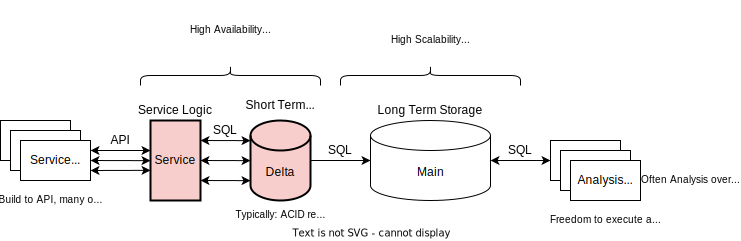
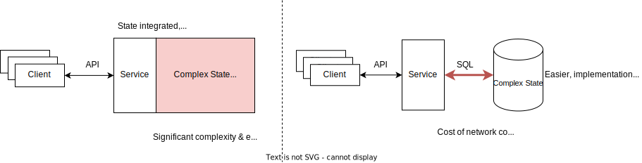
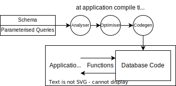
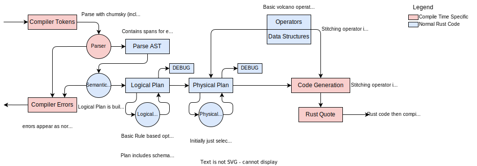

## The Problem

### Slow Delta

Here the requirements for the delta / service do not align with the requirements of the database design typically used.

For example:

- Delta does not need to allow schema changes
- Delta does not need to accept all SQL, only a fixed set of parameterised queries are run
- Delta does not need to support multiple services (the delta is often the bottleneck, scaling to more services does not help)
- [Usually] Delta does not need non-volatile storage support (kept in memory, durability by replica)

And yet these un-needed features compromise the design of the database on the key requirements of the delta

- Delta needs low latency & high throughput

### Inefficient Analysis

Many organisations need to run analysis on chunks of historical data (e.g daily, weekly).

Data is stored in some large historical database, backed by disk storage, and optimised for ease of maintenance and low storage cost.

- Queries rarely change
- Faster Analysis is better, often there is a fixed timeframe (e.g daily analysis of application metrics)

The two most common methods are:

#### Run the analysis directly on the Main

The requirements of an efficient historical store do not align with analysis.

- Can even cause issues (e.g many long running queries causing load spikes)

#### Collect from Main and Run Analysis in a Dataframe Library

A good solution, particularly if the data must come from several different databases. However:

- Redundant transfer (many analyses independently fetch data).
- More engineering work (dataframe libraries do not self-optimise as database planners do for queries)

### Complex Service

Most services are simply a collection of IO, state, and some logic. Here we focus on services where durability is not necessary.

- Server frameworks can abstract away IO (e.g Axum, drogon, Spring)
- Logic usually needs to be hand-written and is application specific
- State management is typically where bugs are most common, testing is hardest, and most code manages.

State needs to be concurrency safe, performant, and maintain invariants.

Ideally a developer could:

- Specify structure of state
- Specify the contstraints/invartiants
- Specify relations between parts of the state
- Specify how state will be accessed
  And then automatically get handles to deal with state, and not have to hand-write, and write tests, documentation, etc.

One way to achieve this is to just use a database, but at the cost of access time (often low access latency is a requirement).

## Solution: Dataframes & Embedded Databases

Embed a database-like library within the application.

There are however some inefficiencies:

- Queries are know at compile time, but dataframes/embedded databases do not take advantage of this.
- When embedding a database, typically the entire database engine is included, even if it is knowable at compile time what parts are not needed.
- language integration is subpar for _embedded databases_, rather than integrating functions & types from the language, they act as a separate entity using SQL types.
- Embedded databases need to check / semantically analyse queries, but if we know all queries when the application is compiled, we could check them then!

## Proposed Solution

Given a schema and queries, generate a database to embed within application code.

- Easy to write schemas & queries.
- Concurrency correctness, enforcing constraints/invariants and data structures automatically handled.
- Efficient code generated at compile time.

This differs from the current dataframe/embedded databases available as it takes advantage of knowing queries at compile time.

language integration is easier as the code produced is in that language.

### Easy Codegen

We can achieve many of the benefits associated with code generation databases, at a fraction of the development cost.

- Inlined volcano operators
- Types known (no runtime tagging or type semantic analysis of queries required)
- Removal of redundant locks & concurrency protections (can analyse query contents)
- Integration means database code can be inlined into application code (and vice versa), potentially reducing some query cost to less than a function call.

- Code produced is a high level language, so can avoid most of codegen difficulty. Extra checks in this language can help ensure correctness and reduce testing burden.
- No need to optimise code generation time (e.g caching query code), as all queries used are generated when the database & application is compiled.

### Language Choices

| Requirement        | C++                                                                                | Rust                             | Zig                                                         |
| ------------------ | ---------------------------------------------------------------------------------- | -------------------------------- | ----------------------------------------------------------- |
| DSL Embedding      | 🔴 No (use external codegen tool)                                                  | 🟢 Excellent (Proc Macros)       | 🟠 Mixed (Comp time powerful, but new syntax not supported) |
| Embedding Code     | 🔴 fragile as few checks can be applied to C++ code embedded within database code. | 🟢 Can rely on compiler checking | 🟢 Use comptime to pass closures of known types             |
| Performance        | 🟢 N/A                                                                             | 🟢 Comparable to C++             | 🟢 Comparable to C++                                        |
| Concurrency Safety | 🔴 Manual, sanitisers available                                                    | 🟢 Data Races Checked            | 🔴 Manual, sanitisers available                             |
| Low Level Access   | 🟢                                                                                 | 🟢 Through `unsafe`              | 🟢                                                          |

I have chosen Rust primarily due to procedural macros (which will underpin this project) being a core feature of the language.

- Embedding DSLs becomes much easier than building an external tool.
- Rust DSLs are a huge part of the language's appeal, examples include `html`, `C` and `python`.

### Language Design

My considered options are:

1. Implement a subset of SQL, and then integrate with rust types.
2. Implement a new language to describe schema and queries.

I decided to go with the latter as:

1. SQL functions are ugly, as users need to write many of these for all queries, making this syntax short & simple is an advantage
2. Use rust-like syntax to take advantage of existing syntax highlighting
3. To better expose the volcano operator/streams model to users.
4. My own frustrations with SQL's syntax.

### Alternative Solutions

Other compile-time generated databases have also been attempted.

#### [MacroDB](https://github.com/xfbs/macrodb) [Rust]

Given a struct (each member is a column), macroDB provides macros to generate thread-safe access & update methods.

- Supports constraints, indices and foreign relations
- Heavily integrated and uses rust types

It is however missing key functionality:

- No query language, and hence no optimisation of queries beyond manually calling access methods.
- Transactions not supported.

## emDB

Less database, more schema compiler.

### [Example Code](./examples/)

### [Plan Analysis](./plan_analysis/)

### Project Ideas

Basic implementation:

1. Develop basic parser, semantic analysis to Logical Plan
2. Basic rule based logical optimisation
3. Add physical plan stage, physical optimiser initially empty / identity.
4. Create debug prints for logical and physical plans, test correctness.
5. Create basic volcano operators, use already existing rust datastructures adapted for some structure & access interface.
6. Implement physical plan codegen.

We need to ensure to start:

- Plan design is simple and easy to debug
- Concurrency safety from the start (per transaction, conservatively safe, all tables accessed locked in transaction)

There are then possible investigations:

1. Investigate improving correctness verification of codegen (e.g using Kani on plan transformations, and code generation)
2. Investigate optimising concurrency (analyse queries to determine the minimum locking required, compare performance against naive implementation)
3. Investigate performance & cost comparison against duckDB, Apache Derby, and against a postgres delta.
4. Investigate optimising data structures & volcano operators within this codegen context. Choose a specific schema + query, optimise data structure & index selection, operator implementation.
5. Add new functionality importing from/exporting to SQL databases (take SQL schema, generate emDB schema, generate import/export functions)
6. Investigate optimising a specific operator's implementation
