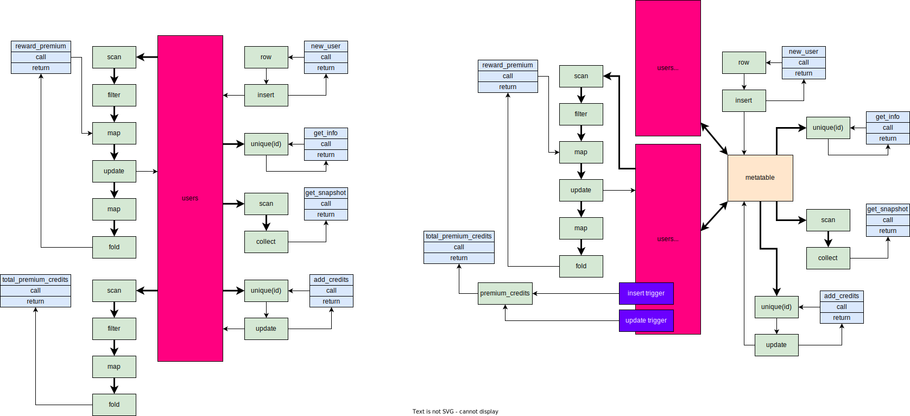

## Requirements
Some schema and queries that are.
- being the abilities of DBtoaster in a useful way
- look somewhat typical of some basic state
- avoid too much complexity in schema (e.g. lots of foreign key relations), and simple enough to diagram for report
- have several possible optimisations to choose from / justifications for discussion in report

## TCP-C & TCP-E
For OLTP workloads.
- Complex, lots e.g.joins, foreign key relations, etc.

## YCSB
For OLTP workloads, implement their benchmarking interface, then it can interact.
- interface does not specify future queries, queries implemented in each system's own lang (easy for SQL based, custom for non-sql)
- Workloads take parameters, then make calls to wrapper for database. 
- Can find [core workloads here](https://github.com/brianfrankcooper/YCSB/tree/master/core/src/main/java/site/ycsb/workloads)
- Not just a schema & some queries as with TCP.

I cannot entirely extract a basic query to reason about.

## Custom Schema
### Schema
```rust
// mocked up in emQL frontend not yet complete
database! {
    name user_details;

    // Reasoning:
    //  - Constraint checking required, needs to fail immediately (hybrid IVM)
    //  - premium is immutable, and iterated over. So we can maintain a view of
    //    two tables for premium & non-premium users
    //  - Very simple table
    table users {
        id: usize,
        name: String,
        premium: bool,
        credits: i32
    } @ gen_pk(id), pred(premium || credits > 0);

    // Description:
    //   Create a row, pipe to insert, insert returns gen_pk id
    // Reasoning:
    //   - Needed for data insert, generation of id only occurs from here,
    //     hence we know the table alone determines id
    //   - Move semantics (taking ownership of data structure from outside the database)
    query new_user(username: String, prem: bool) {
        row(name = username, premium = prem, credits = 0 ) 
            |> insert(users) 
            ~> return;
    }

    // Description:
    //   Get an individual user's data.
    // Reasoning:
    //   - Performance reliant on access to users data structure
    //     hence need to make a good choice of mapping (user id -> data) here.
    query get_info(user_id: usize) {
        users 
            |> unique(id is user_id) 
            ~> return;
    }

    // Description: 
    //    Get a snapshot of the entire users table state
    // Reasoning:
    //    - We can collect the database to a single structure decided by the compiler.
    //    - This can be radically sped up by removing copying of the string (no row deletions, 
    //      immutable attribute, return reference bound to lifetime of database).
    //    - choosing a data structure for `users` table that is good for iteration
    query get_snapshot() {
        users |> collect() ~> return;
    }

    // Description
    //   Update a given user's credits
    // Reasoning:
    //   - Need to apply constraint immediately
    //   - Need to index data structure
    //   - Database can see only credits is updated
    query add_credits(user: usize, creds: i32) {
        ref users 
            |> unique(it.id is user) 
            ~> update(it.credits = credits + creds);
    }

    // Description:
    //   Apply multiplier bonus to premium users, and return the number of credits added
    // Reasoning:
    //   - Applying function over a tight loop
    //   - Iteration advantage form splitting premium users & non-premium
    //   - can be inlined to very simple iterate over &mut and increment sum
    query reward_premium(cred_bonus: f32) {
        ref users 
            |> filter(it.premium)
            |> map(user: ref users = it, new_creds: i32 = ((it.credits as f32) * cred_bonus) as i32)
            |> update(it.credits = new_creds)
            |> map(creds: i32 = new_creds)
            |> sum()
            ~> return;
    }

    // Description:
    //   Get the total number of credits in the premium table
    // Reasoning:
    //   Easy IVM case, all updates & inserts just need to add difference to 
    //   the view
    query total_premium_credits() {
        users
            |> filter(premium)
            |> map(credits: i64 = credits) 
            |> sum() 
            ~> return;
    }
}

fn foo() {
    let db = user_details::new();

    let bob_id = db.new_user(String::from("Bob"), true).expect("No errors possible");
    db.add_credits(bob_id, 23).expect("Valid query");

    let jim_id = db.new_user(String::from("Jim"), false).expect("No errors possible");
    
    use user_details::query_results::AddCredits; 
    assert!(matches(db.add_credits(jim_id, -30), AddCredits::PredicateError(_));
}
```

### Implementations

| Implementation | Description |
|-|-|
| Assuming any possible query | Hashtable for id index (supporting update & delete), generational arena allocator (for deletions) for contents. Scan over table for filters. Snapshot copies strings. |
| With known queries | Separate arena allocators for premium & non-premium, total premium credits updated on insert/update, snapshot uses string references. |

Neither consider concurrency, this is difficult enough as it is.


*Note: Types are not shown, each connection has an associated `name -> type` mapping (e.g `id -> usize, name -> &str`)*

Compare against naive implementation (both embedded, fair comparison), can also compare against postgres (very unfair but to demonstrate).

### Workload
Measure rate of operations per time unit.
- Against a certain table size (updates and queries)
- Cost of inserts as the table size increases
