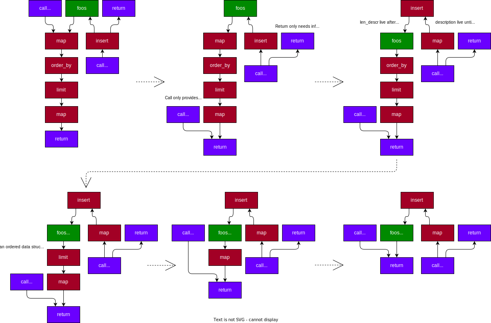

## No Deletions With Heap

We have a basic database of an `id -> description` mapping, where only new descriptions can be added.

```rust
database!(
    name MyDatabase;

    table foos = {
        id: smalltext[20],
        description: largetext,
    }

    query new_foo(id: `&str`, descr: `&str`) = {
        foos
            <| insert(id = id, description = descr)
    }

    query top_10() = {
        foos
            |> map(id = id, descr = description, descr_len = len(description))
            |> order_by(descr_len, asc)
            |> limit(10)
            |> map(id = id, descr = descr_len)
            |> return;
    }
)
```

### Information Advantage

- We only need to top 10, so can keep a heap.
- We can return references from `top_10` bound to the lifetime of the database safely (never updated, never removed)
- We can contiguously allocate all the descriptions (never updated or removed)
- The heap can have a fixed size of 10, as we only insert & never delete, we can ignore any values we dont need to store.

### To Optimise

We apply rule based optimisation on the whole plan (all queries & tables) to push the table (`foos`) through operators.

- Some pushes add constraints (e.g push through `order_by` constrains to the ordered data structures available, `limit` constrains to the fixed size data structures).
- We can apply other optimisations (e.g dead column removal)



### Generated Code

Ideally in this situation:

- `foos` is a fixed-size heap of `(&id, descr_len)`
- `foos[id]` is allocated in a single buffer, with an overflow buffer for larger than 20 characters.

The concurrent interactions are between:

- single row insert from `new_foo`
- multi-row read from `top_10` in a single transaction

As we have simplified to simple access:

- insert lock: can do fine-grained heap insert
- need to lock out for reading all.

Potentially best solution is a coarse RW lock.
